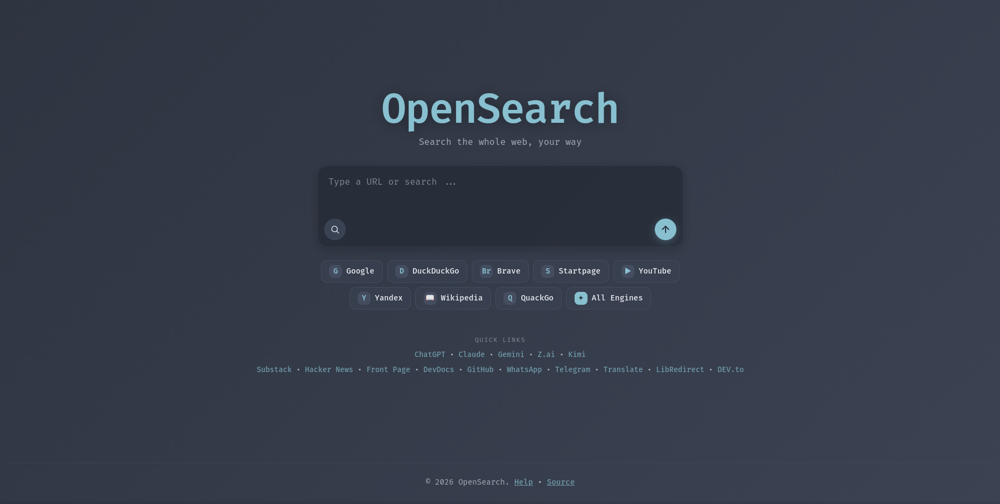

# Browser Home Page - OpenSearch v3.0

A browser homepage built around a single search box.

## Usage

Type a query and press `Enter` to search DuckDuckGo. Type a URL like `github.com` and it opens directly instead of searching. Prefix a query with `@alias` to pick a different engine:

| Engine       | Aliases              |
|--------------|----------------------|
| Google       | @google, @g          |
| DuckDuckGo   | @ddg, @duck          |
| Brave        | @brave, @br          |
| Startpage    | @startpage, @sp      |
| YouTube      | @youtube, @yt        |
| Yandex       | @yandex, @ya         |
| Wikipedia    | @wiki, @w            |
| QuackQuackGo | @quack, @qq, @q      |

"All Engines" opens a picker where you can choose which engines to search at once. Tabs open with a short stagger to avoid popup blockers.

Keyboard shortcuts:

- `Enter`: search DuckDuckGo (or whichever engine you prefixed)
- `Ctrl`/`Cmd` + `Enter`: All Engines picker
- `Shift` + `Enter`: newline inside the box
- `Esc`: clear

Quick links below your most frequently visited websites or custom bookmarks for easy access.

## Setup

No build step required.

1. Clone or download the repo.
2. Open `index.html` in a browser.
3. Set `index.html` as your browser's startup or new tab page.
